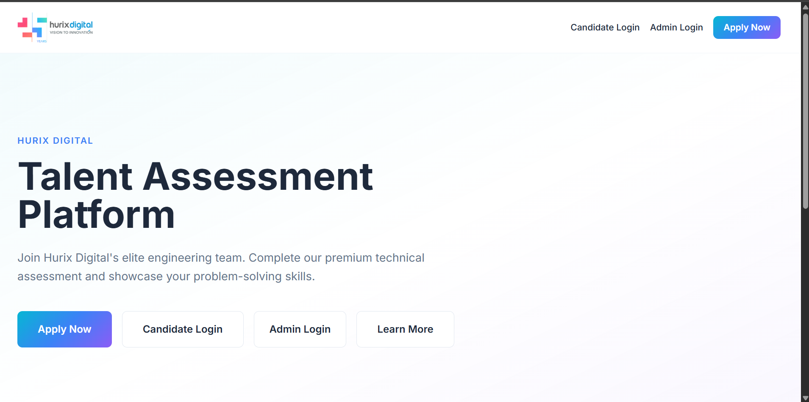

# Hurix Talent Assessment Platform

Enterprise-grade technical hiring platform for **Hurix Digital**. Candidates register with international phone support and experience details, verify email, select a job role, complete a timed coding assessment, and track progress via a dedicated portal. Admins manage candidates, job roles, questions, and analytics through a secure RBAC-protected dashboard.

**Repository:** [github.com/manishhurix/RecruitLeadGen](https://github.com/manishhurix/RecruitLeadGen)

---

## Screenshots

All screenshots are stored in the [`SS/`](./SS) folder.

| Screen | Preview |
|--------|---------|
| Landing Page |  |
| Candidate Registration |  |
| Assessment Email |  |
| Candidate Login |  |
| Candidate Dashboard |  |
| Admin Login |  |
| Admin Dashboard |  |

---

## Features

### Candidate Registration
- Full profile capture: name, email, LinkedIn URL, resume (PDF), referral code, password
- **Years of Experience** — required dropdown (Fresher through 10+ Years)
- **International phone** — searchable country selector with flag, name, and dial code (default: **India +91**)
- Phone stored as `countryCode`, `phoneNumber`, and E.164 `fullPhone` (e.g. `+919876543210`)
- Per-country validation via `libphonenumber-js`

### Candidate Portal (`/login`, `/portal/dashboard`)
- Email verification with assessment link (SMTP / mock mode)
- **Resend verification email** with rate limiting (3 per hour)
- **Google Sign-In** or **email + password** login
- Dashboard: application timeline, assessment status, profile (experience + international phone), history
- **Job role selection** before starting assessment
- One-attempt assessment rule
- Mobile restriction for coding (desktop/tablet only)

### Assessment Engine
- 10 random questions (Python or JavaScript) from 200-question bank
- **Run Code** in browser (Pyodide + Web Worker) for instant feedback
- **Submit** evaluated server-side against hidden test cases
- 60-minute timed session, copy/paste disabled

### Admin Portal (`/admin/*`)
- **RBAC:** `SUPER_ADMIN` (full access) and `ADMIN` (view-only subset)
- JWT authentication with server-side session validation (`GET /api/admin/me`)
- Candidate management: search, filter by experience/country/role/assessment status, resume download
- **Call Candidate** — uses full international number (`tel:+919876543210`)
- **Resume preview** — inline PDF preview modal on candidates list and detail
- **AI assessment review** — generate AI-powered submission review (Super Admin)
- **Job Role Management** — create, edit, activate/deactivate roles (Super Admin)
- **Marketing Analytics** dashboard with UTM attribution (Super Admin)
- **Candidates by Experience** analytics on Super Admin dashboard
- Question bank management (Super Admin)
- Admin user management & platform settings (Super Admin)
- Responsive layout: desktop sidebar, mobile drawer navigation

### UTM Attribution & Marketing Analytics (`/admin/analytics`)
- **Visitor tracking** on every public page visit (first-touch + last-touch UTM)
- Captures `utm_source`, `utm_medium`, `utm_campaign`, `utm_term`, `utm_content`
- Organic traffic auto-classified when no UTM params present
- **Candidate attribution** linked at registration (source, campaign, device, landing page)
- **Conversion funnel:** Visitors → Registrations → Started → Submitted → Shortlisted → Interviewed → Selected → Rejected
- **Source-level funnel** and campaign performance tables
- **Traffic hygiene:** test and internal traffic excluded from production reports by default
- Super Admin toggles: **Include Test Traffic**, **Include Internal Traffic**
- CSV export for analytics reports and candidate attribution data

### Security
- Separate JWT secrets for admin, candidate portal, and assessment links
- Cross-portal token blocking (candidate JWT cannot access admin APIs)
- Rate limiting on login, registration, and verification resend
- bcrypt password hashing
- Protected routes on frontend and backend

---

## Tech Stack

| Layer | Technologies |
|-------|----------------|
| Frontend | React 18, TypeScript, Vite, Tailwind CSS, TanStack Query, Monaco Editor, Pyodide, libphonenumber-js |
| Backend | Node.js, Express, TypeScript, Prisma, PostgreSQL, libphonenumber-js |
| Auth | JWT, Google OAuth, bcrypt |
| Email | Nodemailer (SMTP) |
| Testing | Vitest, Supertest, Playwright |
| Infra | Docker Compose, Nginx (production) |

---

## Quick Start

### Prerequisites
- Node.js 20+
- PostgreSQL 16+ or Docker
- Git

### 1. Clone & configure

```bash
git clone https://github.com/manishhurix/RecruitLeadGen.git
cd RecruitLeadGen
cp .env.example backend/.env
cp .env.example frontend/.env   # add VITE_GOOGLE_CLIENT_ID if using Google login
```

Edit `backend/.env` with your SMTP and Google OAuth credentials as needed.

### 2. Start database

```bash
cp .env.prod.example .env
docker compose -f docker-compose.prod.yml up -d postgres
```

### 3. Backend

```bash
cd backend
npm install
npm run db:setup    # migrate + seed
npm run dev         # http://localhost:4000
```

### 4. Frontend

```bash
cd frontend
npm install
npm run dev         # http://localhost:5173
```

### Default credentials

| Role | URL | Email | Password |
|------|-----|-------|----------|
| Super Admin | `/admin/login` | `admin@hurixdigital.com` | `HurixAdmin@2026` |
| Candidate | `/register` then `/login` | *(self-registered)* | *(set at registration)* |

---

## User Flows

### New candidate
```
Landing → Apply Now → Register (experience + international phone) → Email Sent → Verify Link → Login → Job Role Selection → Ready → Assessment → Thank You
```

### Returning candidate
```
Landing → Candidate Login → Portal Dashboard → Start/Continue Assessment
```

### Admin
```
Landing → Admin Login → Dashboard → Candidates / Job Roles / Analytics / Questions / Users / Settings
```

### UTM campaign link (example)
```
https://talent.hurix.com/?utm_source=youtube&utm_medium=video&utm_campaign=ai_hiring_2026
```
Visitor is tracked on landing; attribution is persisted when the candidate registers.

---

## API Overview

| Prefix | Auth | Purpose |
|--------|------|---------|
| `POST /api/register` | Public | Candidate registration (`phoneCountryIso`, `phoneNumber`, `experienceCategory`, `visitorId`) |
| `POST /api/visitors/track` | Public | Visitor session tracking (UTM + device) |
| `GET /api/verify` | Public | Email link verification |
| `POST /api/candidate/resend-verification` | Candidate JWT | Resend verification email |
| `POST /api/auth/login` | Public | Candidate email/password login |
| `POST /api/auth/google` | Public | Candidate Google login |
| `GET /api/candidate/*` | Candidate JWT | Portal dashboard |
| `GET /api/assessment/*` | Assessment JWT | Assessment session |
| `POST /api/admin/login` | Public | Admin login |
| `GET /api/admin/*` | Admin JWT + RBAC | Admin operations (candidates, job roles, analytics) |
| `GET /api/admin/analytics/*` | Super Admin JWT | Marketing analytics & exports |

See [`docs/TESTING.md`](./docs/TESTING.md) for the full testing strategy and execution guide.
See [`docs/06-API_CONTRACTS.md`](./docs/06-API_CONTRACTS.md) for full API documentation.

---

## Testing

```bash
# From repository root — run all suites
npm test

# Backend only
cd backend
npm run test              # All Vitest tests
npm run test:unit         # Unit tests (phone, experience, validation, etc.)
npm run test:integration  # API + DB integration
npm run test:security     # RBAC & security
npm run test:coverage     # Coverage report
npm run test:e2e          # End-to-end assessment flow script

# Test database setup (hurix_talent_test)
npm run test:db:setup

# Frontend unit tests
cd frontend && npm run test

# Playwright E2E (requires running app)
cd e2e && npm run test
```

---

## Project Structure

```
├── backend/          Express API, Prisma, services, Vitest tests
├── frontend/         React SPA, Vitest tests
├── e2e/              Playwright end-to-end tests
├── docs/             Architecture & requirements (17 documents)
├── SS/               Screenshots for documentation
├── .github/          CI workflows
├── docker-compose.prod.yml
├── .env.prod.example
└── DOCKER_EC2_DEPLOY.md
```

---

## Environment Variables

Copy [`.env.example`](./.env.example) and configure:

| Variable | Description |
|----------|-------------|
| `DATABASE_URL` | PostgreSQL connection string |
| `TEST_DATABASE_URL` | Test database for Vitest integration tests |
| `JWT_ASSESSMENT_SECRET` | Candidate & assessment JWT secret |
| `JWT_ADMIN_SECRET` | Admin JWT secret |
| `EMAIL_MOCK_MODE` | `true` = log emails instead of sending |
| `SMTP_*` | Gmail or other SMTP provider |
| `GOOGLE_CLIENT_ID` | Backend Google token verification |
| `VITE_GOOGLE_CLIENT_ID` | Frontend Google Sign-In button |

---

## Production Deployment

```bash
./scripts/build-sandbox-images.sh   # if using Docker sandbox
docker compose -f docker-compose.prod.yml up -d --build
```

See [`docs/14-DEPLOYMENT_PLAN.md`](./docs/14-DEPLOYMENT_PLAN.md).

---

## Documentation

| Document | Description |
|----------|-------------|
| [Product Requirements](./docs/01-PRODUCT_REQUIREMENTS.md) | Product vision & scope |
| [System Architecture](./docs/04-SYSTEM_ARCHITECTURE.md) | High-level architecture |
| [Database Schema](./docs/05-DATABASE_SCHEMA.md) | Prisma models |
| [API Contracts](./docs/06-API_CONTRACTS.md) | REST API reference |
| [Security Design](./docs/11-SECURITY_DESIGN.md) | Auth & security controls |
| [Admin Dashboard](./docs/12-ADMIN_DASHBOARD_DESIGN.md) | Admin UI design |
| [Testing Guide](./docs/TESTING.md) | Automated testing strategy |

---

## License

Proprietary — Hurix Digital
